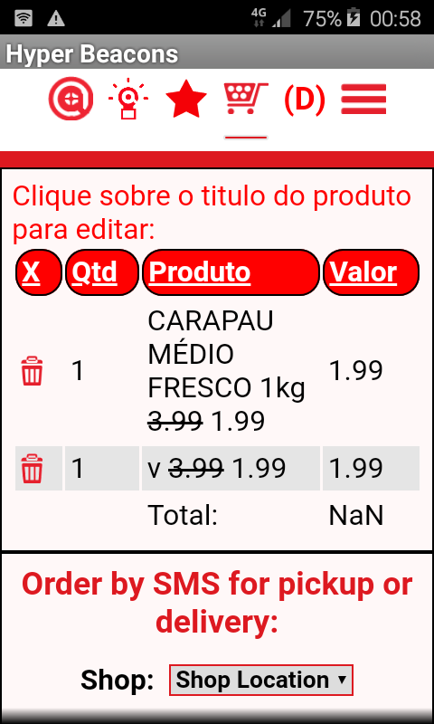
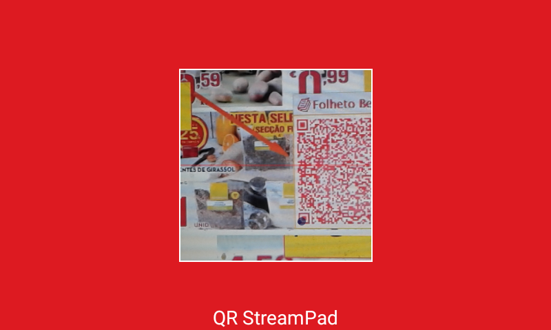

<table style="margin: 0 auto; max-width: 900px" align="center">
	<tr>
		<td>
<strong>- About:  </strong>
		^&nbsp;&nbsp;&nbsp;&nbsp;&nbsp;
		 QRStreamPad is an abstract attempt 
		to use delimited data in QR Code Images in numerous ways.  This 
example uses a QRCode reader to&nbsp; render data using html, javascript and 
an sqlite database. No sucurity exploits checking, refactoring, form-connection validation, 
		etc. are enforced with QRStreamPad code. The code 
is written, rewritten and mashed according to the current imagination spool. 
		It is what it is. Use it at your own risk. 
 <strong>- Usage:</strong> after installing the .apk, open 
		assets/README.html&nbsp; on your laptop or whatever you want to use to 
		generate the QR image that will be scanned by the QRStreamPad android 
		app. After rendering .the QR Code image on README.html qr generator, 
		scan it with android QRStreamPad. Or you can just go to scanning by 
		opening up the assets/images/recipe.jpg or leaflet.jpg. These 2 demos 
		show how qr can be used on advertisement flyers to let the customer 
		easily store essential data. <strong>For instance, the recipe.jpg 
		demo shows how a qr image on the leaflet can send the viewer a cooking 
		recipe of the items on the flyer/leaflet and let the viewer save the 
		recipe and/or order the groceries needed to make the recipe.</strong> 
		Once again, you need to open them on another device or print the images. 
		These qr images can be placed on flyers, coupon cutouts (make e-coupons 
		instantly), media videos, etc.   - <strong>Javascript 
to Java Interface Bridge:</strong> 
		This app relies heavily on the android javascript interface bridge. 
		See how its used in StreamPad.java preparePopUps function. Passing a 
		Javascript Interface and a generic interface to a popup dialog (yeah, 
		reallly).   - <strong>User Interface:</strong> 
Rendering of the user interface relies on simple html and javascript, json. 
&nbsp;  <strong>- Database:</strong> See the assets/README.html  - <strong>
TODO:</strong> 
clean up and comment code. fix javascript json arrays to work correctly with UI. clean up the UI. 
 - <strong>
Credits:</strong> 
Most of the credits for open sourced code that is used in this app is usually 
included in the code. But alot of the code has been treated ginzu style, so if you 
deserve some credit, let us know.  

		</td>
	</tr>
</table>
